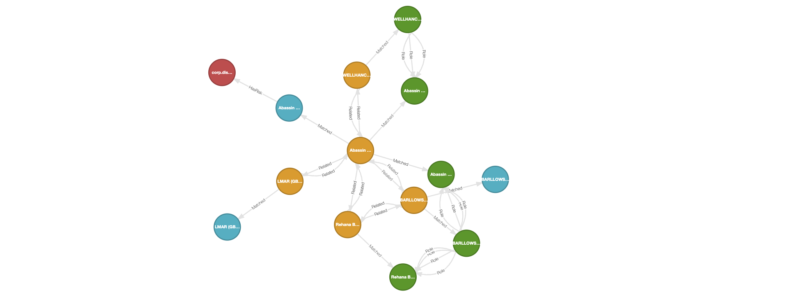

# KGC 2025 Workshop

## Creating high-quality knowledge graphs using Kùzu and Senzing

This repo contains the code for a joint workshop between Kùzu and Senzing at KGC 2025.
The focus is to show how to create high-quality knowledge graphs from heterogeneous
data sources using Kùzu -- which is an embedded, open source _graph database_ -- and
Senzing -- which is an SDK for _entity resolution_.


## Background

The workshop will demonstrate an _investigative graph_ analysis based on patterns of
bad-actor tradecraft. By connecting "risk" data and "link" data within a graph, we
can show patterns of tradecraft such as money laundering, tax evasion, money mules,
and so on. We'll use "slices" of datasets from the following open data providers:

  - <https://www.opensanctions.org/>
  - <https://www.openownership.org/>

[OpenSanctions](https://www.opensanctions.org/) provides the "risk" category of data.
In other words, this describes people and organizations who are known risks for FinCrime.
There is also the [`yente`](https://github.com/opensanctions/yente) API which provides
HTTP endpoints based on the [_FollowTheMoney_](https://followthemoney.tech/) data model
used for investigations and OSInt.

[Open Ownership](https://www.openownership.org/) provides the "link" category of data.
This describes [_ultimate beneficial ownership_](https://en.wikipedia.org/wiki/Beneficial_ownership)
(UBO) details: "Who owns how much of what, and who actually has controlling interest?"
There's also the [_Beneficial Ownership Data Standard_](https://standard.openownership.org/en/0.4.0/)
(BODS) which is an open standard providing guidance for collecting, sharing, and using
high-quality beneficial ownership data, to support corporate ownership transparency.

Recently, Open Ownership has partnered with [GLEIF](https://www.gleif.org/) to launch
the [_Global Open Data Integration Network_](https://godin.gleif.org) (GODIN)
to promote open standards across the world for data interoperability among these
kinds of datasets related to investigating transnational corruption.

There is also a repository with these datasets which are already formatted for
use in Senzing <https://www.opensanctions.org/docs/bulk/senzing/> although these
full sources are quite large to download.

For the purposes of our tutorial, we've selected "slices" of data which connect to
produce interesting subgraphs that illustrate patterns of bad-actor tradecraft.


## Tools

We will be using Kùzu as the _graph database_ and Senzing as the _entity resolution_ engine.
Docker is used to run both the Senzing SDK and Kùzu Explorer, a web-based UI for Kùzu.
Visit the websites to see further instructions for each tool:

 - [Docker](https://docs.docker.com/desktop/)
 - [Kùzu](https://kuzudb.com/)
 - [Senzing](https://senzing.com/) 

**Important:** You will need to have Docker downloaded and installed on your laptop to run this tutorial.
Then we will run the Senzing SDK within a Docker container and load Kùzu as a Python package.


## Setup

Set up a local Python environment in order to run the workshop steps.

### Option 1: `uv` (recommended)

Use [these instructions](https://docs.astral.sh/uv/getting-started/installation/) to install `uv` for your OS.

Next clone the GitHub repo to your laptop:

```bash
git clone https://github.com/kuzudb/kgc-2025-workshop-high-quality-graphs.git
cd kgc-2025-workshop-high-quality-graphs
```

Then use `uv` to install the Python library dependencies:

```bash
uv sync
```

Or use `uv` to install based on the `requirements.txt` file:

```bash
uv pip install -r requirements.txt
```

### Option 2: `pip` (fallback)

If you don't want to use `uv`, you can use `pip` to install the dependencies through
the `requirements.txt` file:

```bash
pip install -r requirements.txt
```


## Data download

Follow the instructions in the [data/README.md](data/README.md) file
to download the required data.


## Running the Senzing container

To run the entity resolution pipeline, we will launch Senzing in Docker, with the data directory
mounted as an external volume, and connect into the container in a shell prompt:

```bash
docker run -it --rm --volume ./data:/tmp/data senzing/demo-senzing
```

This uses <https://github.com/Senzing/senzingapi-tools> for a base
layer in Docker. This includes a set of Python utilties which source
from the <https://github.com/senzing-garage/> public repo on
GitHub. These are located in the `/opt/senzing/g2/python` directory
within the container.

First among these, we'll run the Senzing configuration tool to create
a namespace for the data sources which we'll load later:

```bash
G2ConfigTool.py
```

When you get a `(g2cfg)` prompt, register the two data sources which you downloaded above.
In other words, each dataset has a column with an identifier -- either `"OPEN-SANCTIONS"`
or `"OPEN-OWNERSHIP"` -- naming its source:

```
addDataSource OPEN-SANCTIONS
addDataSource OPEN-OWNERSHIP
save
```

When this tool prompts with `save changes? (y/n)` reply with `y` and
hit enter, then `exit` to get back to the shell prompt.

Now we load the two datasets, which are mounted from your laptop file
system:

```bash
G2Loader.py -f /tmp/data/open-sanctions.json
G2Loader.py -f /tmp/data/open-ownership.json
```

Senzing runs _entity resolution_ as records are loaded.
Then we can export the _entity resolution_ results as a JSON file:

```bash
G2Export.py -F JSON -o /tmp/data/export.json
```

Finally, exit the container to return to your laptop environment:

```bash
exit
```


## Running the workflow

The workshop steps are implemented in the `create_graph.ipynb` notebook. A Python script version is
also provided in the `create_graph.py` file if you want to run the workflow without the Jupyter notebook.

The following files contain utility functions for the sequence of
preprocessing steps required to create the graph:

 - `open_sanctions.py`: Handles the processing of the Open Sanctions data.
 - `open_ownership.py`: Handles the processing of the Open Ownership data.
 - `process_senzing.py`: Handles the processing of the entity resolution export from Senzing.

The steps to run the preprocessing, graph creation, and exploration
steps are in the following files:

 - `create_graph.ipynb`: Runs the preprocessing steps, creates the graph, and performs some basic exploration and visualization.
 - `create_graph.py`: Contains the same functionality as the notebook above, though as a Python script.

To launch the `create_graph.ipynb` notebook in JupyterLab, run the following commands from the root directory of this repo:

```bash
source .venv/bin/activate
.venv/bin/jupyter-lab
```

Further visual exploration of the graph can be done using the Kùzu Explorer UI, whose steps are described below.

## Graph visualization in Kùzu Explorer

To visualize the graph in Kùzu using its browser-based UI, Kùzu Explorer, run the following commands from this
root directory where the `docker-compose.yml` file is:

```bash
docker compose up
```

Alternatively, you can type in the following command in your terminal:

```bash
docker run -p 8000:8000 \
           -v ./db:/database
           -e MODE=READ_WRITE \
           --rm kuzudb/explorer:latest
```

This will download and run the Kùzu Explorer image, and you can access the UI at <http://localhost:8000>

Make sure that the path to the database directory is set to the name of the Kùzu database directory in the code!

In the Explorer UI, enter the following Cypher query in the shell editor to visualize the graph:

```cypher
MATCH (a:Entity)-[b*1..3]->(c)
RETURN *
LIMIT 100
```


