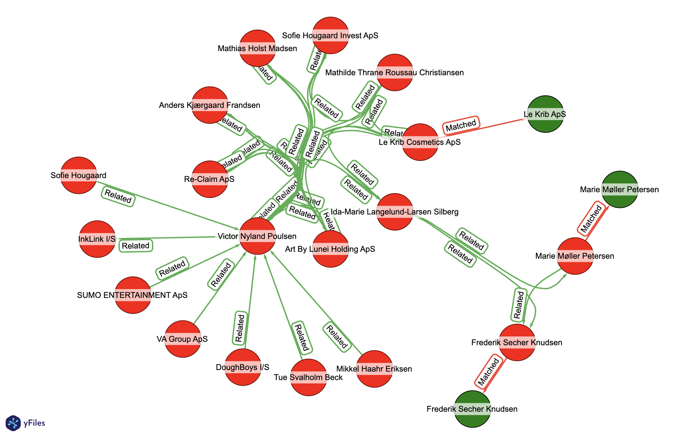

# Knowledge Graph Workshop

## Creating high-quality knowledge graphs using Kuzu and Senzing

This repo contains the code for a joint workshop between Kuzu and
Senzing at at graph conferences in 2025.

The focus is to show how to create high-quality knowledge graphs from
heterogeneous data sources using Kuzu -- which is an embedded, open
source _graph database_ -- and Senzing -- which is an SDK for _entity
resolution_.

### Slides

To follow along, download the slides from the following links:

- Kuzu: [slides](https://docs.google.com/presentation/d/1tErhnbwkjSxREbfpxKdhSOXMwm9ReLKAYxm7_vl6J4U/view?usp=sharing)
- Senzing: [slides](https://drive.google.com/file/d/1EL0TnzWDsNqKE53mPOwXc9UfImkgHH2q/view?usp=sharing)


## Background

The workshop will demonstrate an _investigative graph_ analysis based
on patterns of bad-actor tradecraft. By connecting "risk" data and
"link" data within a graph, we can show patterns of tradecraft such as
money laundering, tax evasion, money mules, and so on. We'll use
"slices" of datasets from the following open data providers:

  - <https://www.opensanctions.org/>
  - <https://www.openownership.org/>

### OpenSanctions

[OpenSanctions](https://www.opensanctions.org/) provides the "risk" category of data.
In other words, this describes people and organizations who are known risks for FinCrime.
There is also the [`yente`](https://github.com/opensanctions/yente) API which provides
HTTP endpoints based on the [_FollowTheMoney_](https://followthemoney.tech/) data model
used for investigations and OSInt.

### Open Ownership

[Open Ownership](https://www.openownership.org/) provides the "link" category of data.
This describes [_ultimate beneficial ownership_](https://en.wikipedia.org/wiki/Beneficial_ownership)
(UBO) details: "Who owns how much of what, and who actually has controlling interest?"
There's also the [_Beneficial Ownership Data Standard_](https://standard.openownership.org/en/0.4.0/)
(BODS) which is an open standard providing guidance for collecting, sharing, and using
high-quality beneficial ownership data, to support corporate ownership transparency.

Recently, Open Ownership has partnered with [GLEIF](https://www.gleif.org/) to launch
the [_Global Open Data Integration Network_](https://godin.gleif.org) (GODIN)
to promote open standards across the world for data interoperability among these
kinds of datasets related to investigating transnational corruption.

There is also a repository with these datasets which are already formatted for
use in Senzing <https://www.opensanctions.org/docs/bulk/senzing/> although these
full sources are quite large to download.


## Datasets

For the purposes of this tutorial, we've selected "slices" of data
from OpenSanctions and Open Ownership which connect to produce
interesting subgraphs that illustrate patterns of bad-actor
tradecraft.

Follow the instructions in the [data/README.md](data/README.md) file
to download the required data and inspect the JSON files to get an
idea of their contents.


## Tools

We will be using Kuzu as the _graph database_ and Senzing as the
_entity resolution_ engine. Docker is used to run both the Senzing
SDK and Kuzu Explorer, a web-based UI for Kuzu. Visit the websites to
see further instructions for each tool:

 - [Docker](https://docs.docker.com/desktop/)
 - [Kuzu](https://kuzudb.com/)
 - [Senzing](https://senzing.com/) 

**Important:** You will need to have Docker downloaded and installed
on your laptop to run this tutorial.  Then we will run the Senzing SDK
within a Docker container and load Kuzu as a Python package.


## Setup

Set up a local Python environment in order to run the workshop steps.

### Option 1: `uv` (recommended)

Use [these instructions](https://docs.astral.sh/uv/getting-started/installation/) to install `uv` for your OS.

Next clone the GitHub repo to your laptop:

```bash
git clone https://github.com/kuzudb/kgc-2025-workshop-high-quality-graphs.git
cd kgc-2025-workshop-high-quality-graphs
```

Then use `uv` to install the Python library dependencies:

```bash
uv sync
```

Or use `uv` to install based on the `requirements.txt` file:

```bash
uv pip install -r requirements.txt
```

### Option 2: `pip` (fallback)

If you don't want to use `uv`, you can use `pip` to install the dependencies through
the `requirements.txt` file:

```bash
pip install -r requirements.txt
```


## Running the Senzing container

To run the entity resolution pipeline, we will launch Senzing in
Docker, with the data directory mounted as an external volume, then
connect into the container in a shell prompt:

```bash
docker run -it --rm --volume ./data:/tmp/data senzing/demo-senzing
```

This uses <https://github.com/Senzing/senzingapi-tools> for a base
layer in Docker. This includes a set of Python utilties which source
from the <https://github.com/senzing-garage/> public repo on
GitHub. These are located in the `/opt/senzing/g2/python` directory
within the container.

First among these, we'll run the Senzing configuration tool to create
a namespace for the data sources which we'll load later:

```bash
G2ConfigTool.py
```

When you get a `(g2cfg)` prompt, register the two data sources which you downloaded above.
In other words, each dataset has a column with an identifier -- either `"OPEN-SANCTIONS"`
or `"OPEN-OWNERSHIP"` -- naming its source:

```
addDataSource OPEN-SANCTIONS
addDataSource OPEN-OWNERSHIP
save
```

When this tool prompts with `save changes? (y/n)` reply with `y` and
hit enter, then `exit` to get back to the shell prompt.

Now we load the two datasets, which are mounted from your laptop file
system:

```bash
G2Loader.py -f /tmp/data/open-sanctions.json
G2Loader.py -f /tmp/data/open-ownership.json
```

Senzing runs _entity resolution_ as records are loaded.
Then we can export the _entity resolution_ results as a JSON file:

```bash
G2Export.py -F JSON -o /tmp/data/export.json
```

Finally, exit the container to return to your laptop environment:

```bash
exit
```


## Running the workflow

The workshop steps are implemented in the `create_graph.ipynb`
notebook. A Python script version is also provided in the
`create_graph.py` file if you want to run the workflow without the
Jupyter notebook.

The following files contain utility functions for the sequence of
preprocessing steps required to create the graph:

 - `open_sanctions.py`: Handles processing of OpenSanctions data.
 - `open_ownership.py`: Handles processing of Open Ownership data.
 - `process_senzing.py`: Handles processing of the entity resolution export from Senzing.

The steps to run the preprocessing, graph creation, and exploration
steps are in the following files:

 - `create_graph.ipynb`: Runs the preprocessing steps, creates the graph, and performs some basic exploration and visualization.
 - `create_graph.py`: Contains the same functionality as the notebook above, though as a Python script.

To launch the `create_graph.ipynb` notebook in JupyterLab, run the
following commands from the root directory of this repo:

```bash
source .venv/bin/activate
.venv/bin/jupyter-lab
```

Further visual exploration of the graph can be done using the Kuzu
Explorer UI, whose steps are described below.


## Graph visualization in Kuzu Explorer

To visualize the graph in Kuzu using its browser-based UI, Kuzu
Explorer, run the following commands from this root directory where
the `docker-compose.yml` file is:

```bash
docker compose up
```

Alternatively, you can type in the following command in your terminal:

```bash
docker run -p 8000:8000 \
           -v ./db:/database
           -e MODE=READ_WRITE \
           --rm kuzudb/explorer:latest
```

This will download and run the Kuzu Explorer image, and you can access
the UI at <http://localhost:8000>

Make sure that the path to the database directory is set to the name
of the Kuzu database directory in the code!

In the Explorer UI, enter the following Cypher query in the shell
editor to visualize the graph:

```cypher
MATCH (a:Entity)-[b*1..3]->(c)
RETURN *
LIMIT 100
```


## Optional: NetworkX

The `create_graph.ipynb` notebook also contains an optional step to
convert the Kuzu graph to a NetworkX graph.  We run a NetworkX graph
algorithm called Betweenness Centrality to find the most important
nodes in the graph.

"Victor Nyland Poulsen" is the entity in the graph with the highest
betweenness centrality.

| id | descrip | betweenness_centrality |
| --- | --- | --- |
| sz_100036 | Victor Nyland Poulsen | 0.002753 |
| sz_100225 | Daniel Symmons | 0.002251 |
| sz_100003 | Kenneth Kurt Hansen | 0.001314 |
| sz_100092 | Daniel Lee Symons | 0.001273 |
| sz_100023 | Rudolf Esser | 0.001176 |



The visualization shown uses the circular layout in yFiles to
represent a large number of relationships more compactly.  Check out
the notebook and try more graph visualizations and algorithms to
further analyze the data!


## Money Laundering

The [AML.md](AML.md) file enumerates heuristics used by fraud analysts
for transaction monitoring and alerts. These consideration describe
how to assess if a bank account has been used for money laundering. In
other words, this is helpful info for anyone who's new to anti-money
laundering (AML) or anyone thinking of becoming a money launderer.

While it's possible to get open data describing companies, their
ownership, and sanctions risks -- i.e., the "risk" and "link" data in
an investigative graph -- it's difficult to obtain "event" data such
as financial transactions. Generally this class of data is much too
confidential; however, in some cases transactions for large-scale
fraud have been leaked.

[Howard Wilkinson](https://www.ft.com/content/32d47fd8-c18b-11e8-8d55-54197280d3f7)
was the whistleblower regarding massive scale money laundering at
the Estonia branch of Danske Bank, which included the
[Azerbaijani Laundromat](https://www.occrp.org/en/project/the-azerbaijani-laundromat)
case.
Simulation methods defined in the `aml.py` Python module are
based on analysis from known money laundering cases, such as
what was discovered about Danske Bank.

In this workflow we generate synthetic data to simulate money
laundering. We use shell companies which were part of real-world fraud
network, then generate simulated transactions based on statistical
analysis of leaked bank data.

  - `aml_transact.ipynb`: extracts a fraud network, then generates transactions
